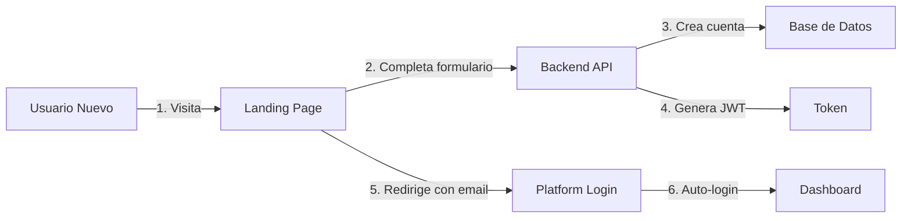

# 🔐 Documentación del Sistema de Autenticación y Flujo de Conexión
## Job Platform - Arquitectura Multi-Aplicación

---

## 📋 Resumen Ejecutivo

Job Platform es una solución empresarial compuesta por tres aplicaciones independientes pero integradas:

1. **Landing Page** - Portal de entrada y registro
2. **Platform Dashboard** - Aplicación principal para gestión
3. **Backend API** - Servidor central de datos y lógica de negocio

### 🎯 Objetivos del Sistema

- **Experiencia de usuario fluida**: Login único para acceder a todas las funcionalidades
- **Seguridad robusta**: Autenticación basada en tokens JWT
- **Sincronización perfecta**: Estado consistente entre todas las ventanas/pestañas
- **Escalabilidad**: Arquitectura preparada para miles de usuarios concurrentes

---

## 🏗️ Arquitectura del Sistema

### Componentes Principales

```
┌─────────────────────┐     ┌─────────────────────┐     ┌─────────────────────┐
│   LANDING PAGE      │     │  PLATFORM DASHBOARD │     │    BACKEND API      │
│   (Puerto 3000)     │     │    (Puerto 3006)    │     │   (Puerto 3002)     │
│                     │     │                     │     │                     │
│ • Marketing         │     │ • Dashboard         │     │ • Autenticación     │
│ • Registro          │────▶│ • Gestión Campañas  │◀────│ • Base de Datos     │
│ • Login inicial     │     │ • Analytics         │     │ • Lógica Negocio    │
│                     │     │ • Configuraciones   │     │ • APIs Externas     │
└─────────────────────┘     └─────────────────────┘     └─────────────────────┘
         NextJS                     NextJS                   NodeJS/Express
```

### Tecnologías Utilizadas

| Componente | Tecnología | Propósito |
|------------|------------|-----------|
| Landing Page | Next.js 15 + NextAuth | Portal público, SEO optimizado |
| Platform Dashboard | Next.js 15 + Context API | Aplicación privada, alto rendimiento |
| Backend API | Node.js + Express + SQL Server | API REST, procesamiento de datos |
| Autenticación | JWT (JSON Web Tokens) | Seguridad stateless |
| Sincronización | BroadcastChannel API | Comunicación entre pestañas |

---

## 👤 Flujos de Usuario

### 1. Registro de Nuevo Usuario



**Datos requeridos para registro:**
- Nombre y Apellido
- Empresa
- Email (único)
- Contraseña
- Teléfono

### 2. Login de Usuario Existente

#### Opción A: Desde Landing Page
```
Landing (3000) → Backend (3002) → Platform (3006)
```

#### Opción B: Directo en Platform
```
Platform (3006) → Backend (3002) → Dashboard
```

### 3. Navegación Autenticada

Una vez autenticado, el usuario puede:
- Acceder a todas las secciones del Platform
- Abrir múltiples pestañas (estado sincronizado)
- Realizar operaciones sin re-autenticarse
- Sesión activa por 24 horas (configurable)

---

## 🔒 Sistema de Autenticación

### Flujo Técnico de Autenticación

```
┌──────────┐      ┌──────────┐      ┌──────────┐      ┌──────────┐
│  Usuario │      │ Frontend │      │ Backend  │      │    BD    │
└────┬─────┘      └────┬─────┘      └────┬─────┘      └────┬─────┘
     │                 │                 │                 │
     │ Email/Password  │                 │                 │
     ├────────────────▶│                 │                 │
     │                 │ POST /login     │                 │
     │                 ├────────────────▶│                 │
     │                 │                 │ Verificar      │
     │                 │                 ├────────────────▶│
     │                 │                 │                 │
     │                 │                 │◀────────────────┤
     │                 │ JWT Token       │   Usuario OK    │
     │                 │◀────────────────┤                 │
     │ Login Success   │                 │                 │
     │◀────────────────┤                 │                 │
     │                 │                 │                 │
```

### Componentes de Seguridad

1. **JWT Token**
   - Duración: 24 horas
   - Contenido: ID usuario, email, rol
   - Firmado con secret key

2. **Almacenamiento**
   - Frontend: localStorage (auth_token, auth_user)
   - No se almacenan contraseñas
   - Limpieza automática en logout

3. **Validación**
   - Cada request al API incluye token
   - Backend valida en cada llamada
   - 401 = Sesión expirada → Logout automático

---

## 🔄 Sincronización entre Pestañas

### Sistema de Sincronización en Tiempo Real

El Platform implementa un sistema avanzado de sincronización que garantiza:

1. **Login sincronizado**: Iniciar sesión en una pestaña = Todas autenticadas
2. **Logout sincronizado**: Cerrar sesión en una pestaña = Todas desconectadas
3. **Detección de expiración**: Si el token expira, todas las pestañas se desconectan

### Tecnología: BroadcastChannel API

```javascript
// Eventos sincronizados:
- LOGIN: Nueva sesión iniciada
- LOGOUT: Sesión cerrada
- SESSION_EXPIRED: Token expirado
- TOKEN_REFRESHED: Token renovado
```

### Diagrama de Sincronización

```
┌─────────────┐     ┌─────────────┐     ┌─────────────┐
│   Pestaña 1 │     │   Pestaña 2 │     │   Pestaña 3 │
│   (Activa)  │     │  (Inactiva) │     │  (Inactiva) │
└──────┬──────┘     └──────┬──────┘     └──────┬──────┘
       │                   │                   │
       │ Usuario hace      │                   │
       │ logout            │                   │
       ▼                   ▼                   ▼
   BROADCAST ─────────▶ RECIBE ──────────▶ RECIBE
   LOGOUT EVENT         EVENTO             EVENTO
       │                   │                   │
       ▼                   ▼                   ▼
   Limpia datos        Limpia datos       Limpia datos
       │                   │                   │
       ▼                   ▼                   ▼
   Redirige a          Redirige a         Redirige a
   Landing             Landing             Landing
```

---

## 🚨 Manejo de Errores y Sesiones

### Escenarios de Error

1. **Token Expirado (401)**
   - Sistema detecta automáticamente
   - Muestra mensaje al usuario
   - Redirige a login
   - Sincroniza todas las pestañas

2. **Error de Red**
   - Reintentos automáticos (3 intentos)
   - Mensajes de error claros
   - No pierde datos del formulario

3. **Sesión Duplicada**
   - Última sesión válida
   - Sesiones anteriores se invalidan

### Timeout de Sesión

- **Inactividad**: 30 minutos
- **Token**: 24 horas máximo
- **Verificación**: Cada 30 segundos (heartbeat)

---

## 📊 Métricas y Monitoreo

### KPIs de Autenticación

- Tiempo promedio de login: < 2 segundos
- Tasa de éxito de autenticación: > 99%
- Sesiones concurrentes soportadas: 10,000+
- Tiempo de sincronización entre pestañas: < 100ms

### Logs y Auditoría

Todos los eventos de autenticación se registran:
- Intentos de login (exitosos y fallidos)
- Logouts
- Cambios de contraseña
- Accesos a recursos protegidos

---

## 🛠️ Guía Técnica Rápida

### Endpoints Principales

```bash
# Autenticación
POST /api/auth/register    # Registro nuevo usuario
POST /api/auth/login       # Login
POST /api/auth/logout      # Logout
GET  /api/auth/verify      # Verificar token
POST /api/auth/refresh     # Renovar token

# Todos los demás endpoints requieren:
Headers: {
  "Authorization": "Bearer {JWT_TOKEN}",
  "Content-Type": "application/json"
}
```

### Variables de Entorno

```env
# Landing Page
NEXT_PUBLIC_API_URL=http://localhost:3002
NEXT_PUBLIC_FRONTEND_URL=http://localhost:3006

# Platform Dashboard  
NEXT_PUBLIC_API_URL=http://localhost:3002
NEXT_PUBLIC_LANDING_URL=http://localhost:3000

# Backend
JWT_SECRET=your-secret-key
JWT_EXPIRATION=24h
DB_USER=jobplatform
DB_PASSWORD=JobPlatform2025!
```

---

## 🚀 Beneficios del Sistema

### Para el Negocio

1. **Experiencia de Usuario Premium**
   - Login único y simple
   - Sin re-autenticaciones molestas
   - Sincronización perfecta

2. **Seguridad Empresarial**
   - Tokens seguros, no cookies
   - Logout inmediato en todas partes
   - Auditoría completa

3. **Escalabilidad**
   - Arquitectura preparada para crecer
   - Sin límite de usuarios
   - Performance optimizada

### Para el Desarrollo

1. **Mantenibilidad**
   - Componentes independientes
   - Código modular
   - Fácil de testear

2. **Flexibilidad**
   - APIs RESTful estándar
   - Fácil integración
   - Documentación clara

3. **Monitoreo**
   - Logs estructurados
   - Métricas en tiempo real
   - Debugging facilitado

---

## 📝 Casos de Uso Comunes

### 1. Usuario olvida cerrar sesión
- **Solución**: Timeout automático tras 30 min de inactividad
- **Resultado**: Seguridad garantizada

### 2. Usuario abre múltiples pestañas
- **Solución**: BroadcastChannel sincroniza estado
- **Resultado**: Experiencia consistente

### 3. Token expira durante uso
- **Solución**: Detección automática + mensaje claro
- **Resultado**: Usuario entiende qué pasó

### 4. Usuario cambia de dispositivo
- **Solución**: Login independiente por dispositivo
- **Resultado**: Flexibilidad total

---

## 🔮 Roadmap Futuro

### Corto Plazo (1-3 meses)
- [ ] Refresh tokens automáticos
- [ ] 2FA (Autenticación de dos factores)
- [ ] Remember me (Recordar sesión)

### Medio Plazo (3-6 meses)
- [ ] SSO (Single Sign-On) empresarial
- [ ] Biometría (Touch/Face ID)
- [ ] Login social (Google, LinkedIn)

### Largo Plazo (6-12 meses)
- [ ] OAuth2 provider
- [ ] API Keys para integraciones
- [ ] Multi-tenant avanzado

---

## 📞 Contacto y Soporte

- **Documentación técnica**: `/docs/api`
- **Equipo de desarrollo**: dev@jobplatform.com
- **Soporte**: support@jobplatform.com
- **Estado del sistema**: status.jobplatform.com

---

*Última actualización: Enero 2025*
*Versión: 1.0*
